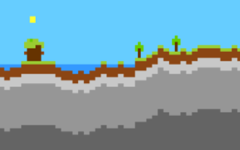
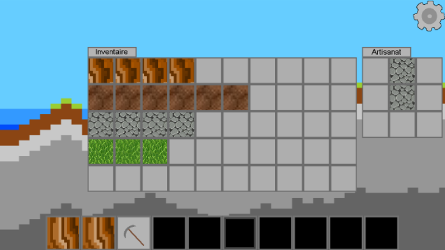

# Blocky
Terraria-like game in C : 2D exploration/mining game.

    
    
    

## The map
The game is made with SDL, a graphics library in C. 
The map is made with a combination of rules and randomness.

## A bit of gameplay
You have an inventory, and every piece of material that you mine gets in there. With the good combination of wood you can make a pickaxe and hence mine rocks ! 

## License

The content of this project itself is licensed under the [Creative Commons Attribution 4.0 International license](https://creativecommons.org/licenses/by/4.0/), and the underlying source code used to format 
and display that content is licensed under the [3-Clause BSD License](https://opensource.org/licenses/BSD-3-Clause).

## Contributors

* [ Baptiste Rossigneux ](https://github.com/BabaVegato)
* [ Axel Farrugia ](https://github.com/AxelFarr)

